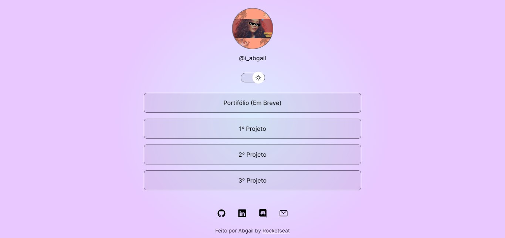

<h1 align="center">🔗Projeto Agregador de Links </h1>

## 💻 Projeto

O site é um cartão de visitas online com links de projetos já realizados e em breve do portifólio.

- [Visite o projeto online](https://abgail-diniz.github.io/my.links/)

 
<h3>Imagem do site no tema Noite 🌚</h3>

<h3>Imagem do site no tema Dia 🌞</h3>

 

## 🚀 Tecnologias

Esse projeto foi desenvolvido com as seguintes tecnologias:

- HTML  
- CSS
- JavaScript
- Figma

___

👩‍💻 O site foi feito colocando em prática 
as aulas do projeto DevLinks da Rocketseat. 

DevLinks é um programa gratuito da rocketseat onde o educador Mayk Brito, ensina com clareza, calma explicando cada passo do projeto.   

